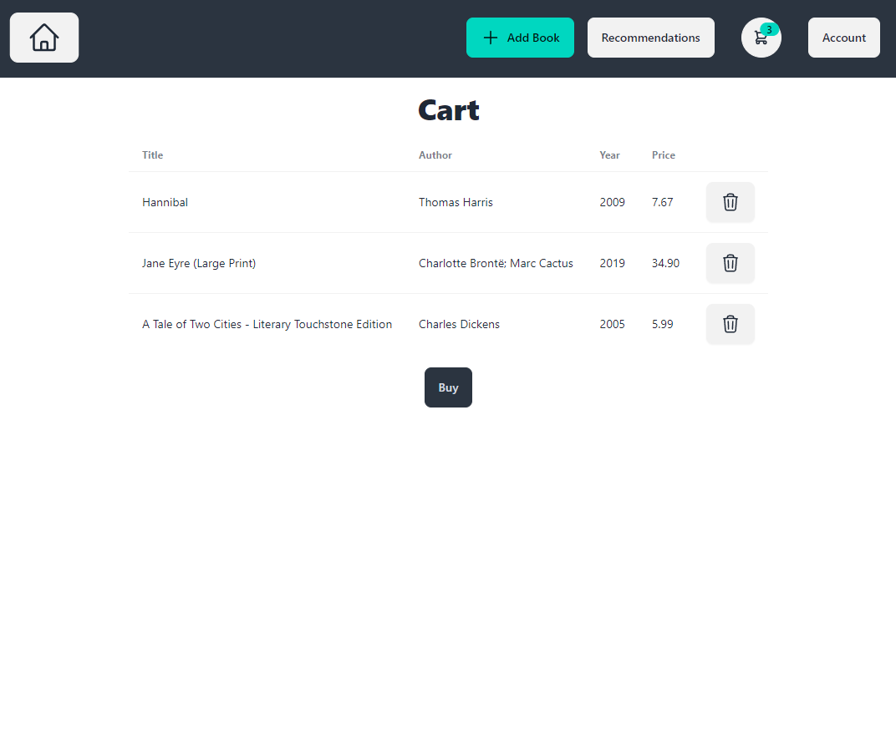

# Book Reviews Project

Web app that manages books and related reviews from users. React was used as front end, Flask as back end, and PostgreSQL as DBMS.

## Dataset

Amazon Books Reviews: [link](https://www.kaggle.com/datasets/mohamedbakhet/amazon-books-reviews/data)

## Front end

Install dependencies with `npm install`, then start React with `npm start`. Open [http://localhost:3000](http://localhost:3000) to view the web app in your browser.

## Back end

Install the packages listed in `requirements.txt`. Then start the server with `flask run --debug`.

## DBMS

Place your `config.ini` file for PostgreSQL in `src/api`.

You can run `python initialize.py` in `src/api` to create tables and populate them with data from the dataset. This operation can take a couple of minutes. Make sure to properly change the dataset path in `dataset.py`.

## Images

### Home Page

### Add Book Page

### Edit Book Page

### Sign Up Page

### Sign In Page

### Account Page

### Cart Page

### Recommendations Page

### Book Details Page

